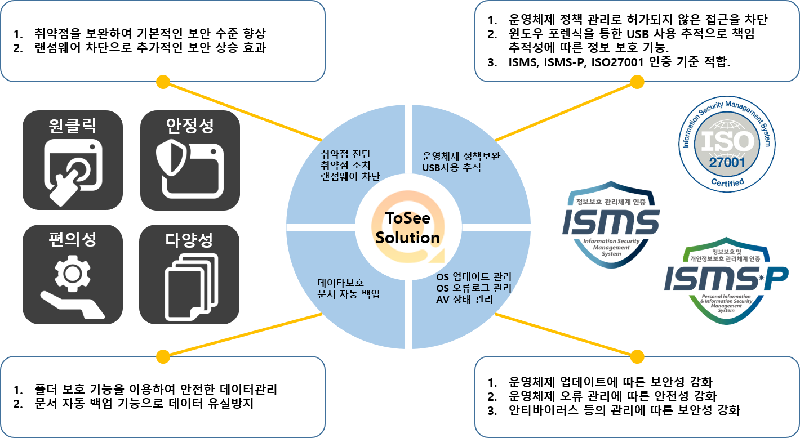

Personal version | Enterprise Version | Latest Version 
-------| ------- | -------
 |  |   

&nbsp;
기술 블로그에서는 ToSee에 대한 소개와 사용법만 안내를 해드리고 있습니다. 라이센스 및 다운로드에 대해서는 담당자에게 문의해주세요.

&nbsp;
&nbsp;
## ToSee 기대 효과

&nbsp;
&nbsp;
### 보안 수준 향상과 보안 인증을 함께
&nbsp;

