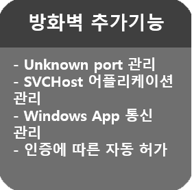
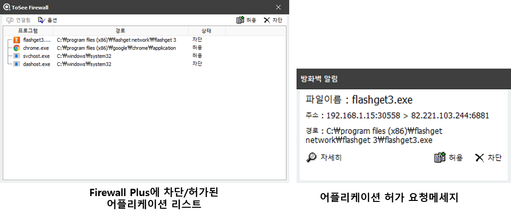

Enterprise Version | Latest Version 
------- | -------
  |   

&nbsp;
기술 블로그에서는 ToSee에 대한 소개와 사용법만 안내를 해드리고 있습니다. 라이센스 및 다운로드에 대해서는 담당자에게 문의해주세요.

&nbsp;
&nbsp;
### 주요기능 : 윈도우 USB 포트를 통한 저장매체 사용 제어
&nbsp;

|||
|:-----:|:-----|
| 최초 설치시 | |
|  |  |
