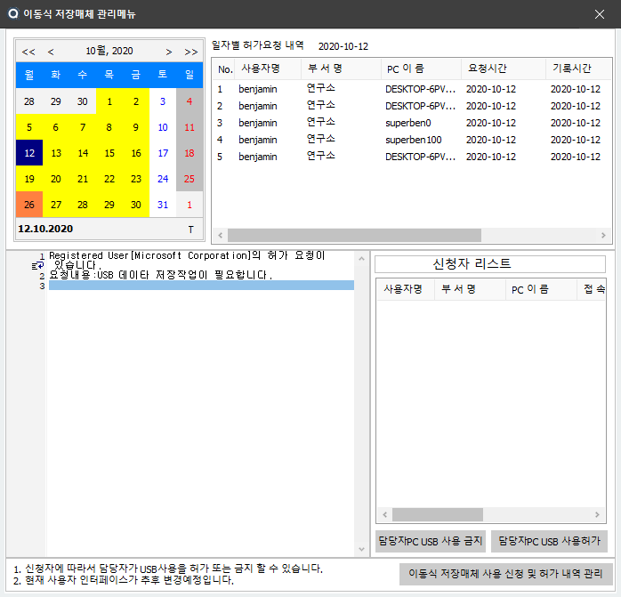
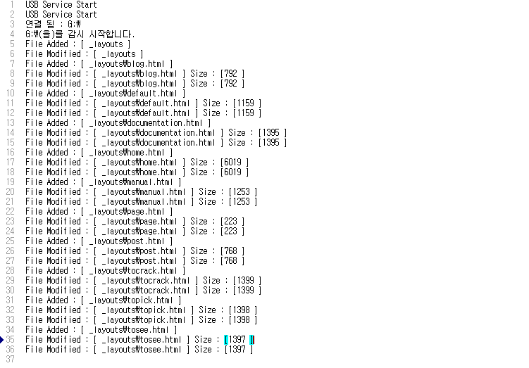

Enterprise Version | Latest Version 
------- | -------
  |   

&nbsp;
기술 블로그에서는 ToSee에 대한 소개와 사용법만 안내를 해드리고 있습니다. 라이센스 및 다운로드에 대해서는 담당자에게 문의해주세요.

&nbsp;
&nbsp;
### 주요기능 : 윈도우 USB 포트를 통한 저장매체 사용 제어
&nbsp;

|||
|:-----|:-----:|
| <b>요청 내역의 관리</b>   사용자들로부터 관리자에게 USB 사용 요청을 한 내역과   허가 및 차단 내역이 관리자의 PC에 파일DB로 저장되며   관리자는 매니저에서 요청 내역을 바로 확인 할 수   있습니다. |  |
| <b>사용 내역의 저장</b>   USB 사용이 허가된 시스템에서는 USB 저장장치에서  작업한 파일의 복사,이동,삭제 내역이 ToSee의 Log폴더   내에 저장이 되며 관리자는 추후 이 내용까지 확인이   가능 합니다.|  |
