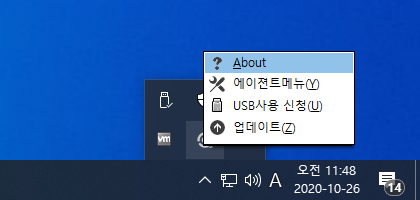
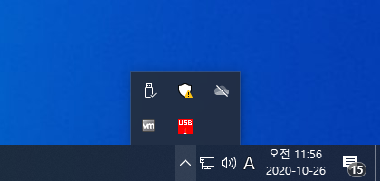

&nbsp;
&nbsp;
## USB Media Control
&nbsp;

### USB 매체 제어 사용법

| 최초 설치시 상태 |
|:-----|
| 1. 상태 알림      2. Tray Icon Menu      3. 환경 설정 메뉴    |
| 1. 최초 설치후 실행시 USB 포트가 차단되어 있다.   2. 담당자(관리자)가 등록되어 있지 않은 경우에는 신청메뉴등도 보이지 않는다.   3. 환경설정 메뉴를 오픈하면 담당자모드 활성화 버튼이 활성화 되어 있다. |

&nbsp;

| 담당자 모드 활성화 |
|:-----|
| 1. 담당자모드 활성화      2. 담당자ID 및 패스워드 입력      3. 담당자모드 활성화 완료    |
| 1. 담당자(관리자)가 담당자모드 활성화를 해야만 사용자는 USB허가 신청이 가능해지고 담당자는 USB매니저가 활성화 된다.   2. 매니져사이트에 등록된 담당자아이디를 이용하여 담당자모드를 활성화 한다.   3. 담당자모드 활성화가 완료 되면 사용자들은 주기적으로 담당자정보를 받아서 저장하게 된다.  |

&nbsp;

| 담당자 정보 확인 |
|:-----|
| 1. 담당자 확인       2. USB 사용 신청 메뉴 활성화     3. USB 매니져 메뉴 활성화    |
| 1. 일정시간이 지나야 담당자 확인이 가능하기 때문에 빠른 사용을 위해서 담당자 확인 버튼을 이용하여 정보를 받을 수 있다.   2. 담당자 확인을 통해 USB 사용 신청 메뉴의 활성화 상태를 확인할 수 있다.   3. 담당자(관리자)또한 USB매니져 메뉴가 활성화 된것이 확인 가능하다. |

&nbsp;

| USB 사용 허가 신청 (사용자) |
|:-----|
| 1. USB 사용 허가 신청       2. USB사용 로그기록 확인 동의     3. 신청중 대기    |
| 1. 요청 내용을 입력후 USB 사용 로그기록 확인 동의를 체크후 승인요청 버튼을 누른다.   2. USB 사용 로그기록 확인 동의는 사용자가 USB에서 작업한 내용의 로그를 담당자에게 전송한다.  - 현재는 로그만 남기고 있음   3. 담당자의 허가 또는 차단등의 처리가 올때까지 대기한다.|

&nbsp;

| USB 사용 허가 및 관리 (담당자:관리자) |
|:-----|
| 1. 허가 신청자 확인       2. USB 매니져    |
| 1. 일정시간이 지나야 담당자 확인이 가능하기 때문에 빠른 사용을 위해서 담당자 확인 버튼을 이용하여 정보를 받을 수 있다.   2. 담당자 확인을 통해 USB 사용 신청 메뉴의 활성화 상태를 확인할 수 있다. |

&nbsp;

| 알림센터(Windows10)  |
|:-----|
| 1. 차단 알림       2. 허가 알림      3. 알림 메세지 관리    |
| Windows10의 알림센터기능을 이용하여 USB의 차단, 허가를 알려주며 알림센터에 해당 메세지들이 저장된다.|

