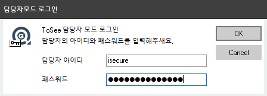

&nbsp;
&nbsp;
## USB Media Control
&nbsp;

### USB 매체 제어 사용법

| 최초 설치시 상태 |
|:-----|
| 1. 상태 알림      2. Tray Icon Menu      3. 환경 설정 메뉴    |
| 1. 최초 설치후 실행시 USB 포트가 차단되어 있다.   2. 담당자(관리자)가 등록되어 있지 않은 경우에는 신청메뉴등도 보이지 않는다.   3. 환경설정 메뉴를 오픈하면 담당자모드 활성화 버튼이 활성화 되어 있다. |

&nbsp;

| 담당자 모드 활성화 |
|:-----|
| 1. 담당자모드 활성화      2. 담당자ID 및 패스워드 입력      3. 담당자모드 활성화 완료      4. 담당자 정보 확인   |
| - 방화벽플러스에서 관리하고 있는 어플리케이션과 그 상태에 대해서 리스트를 확인 할 수 있다. |

